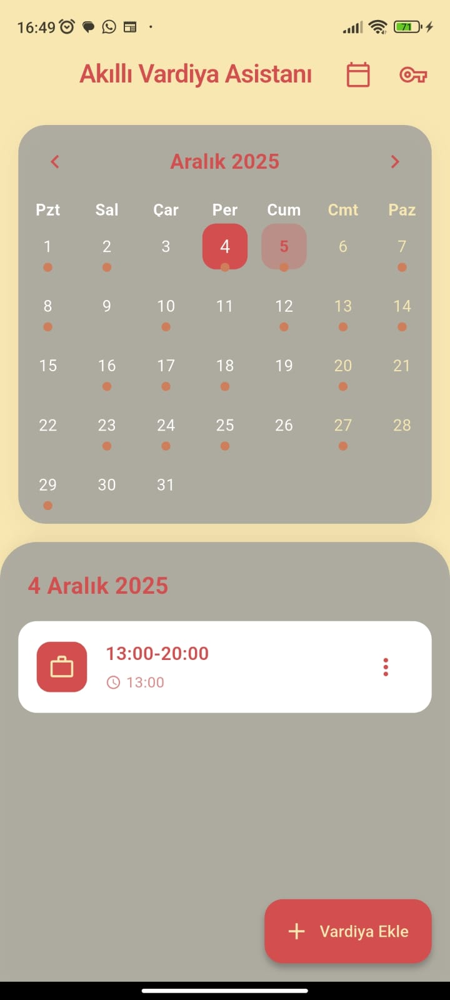
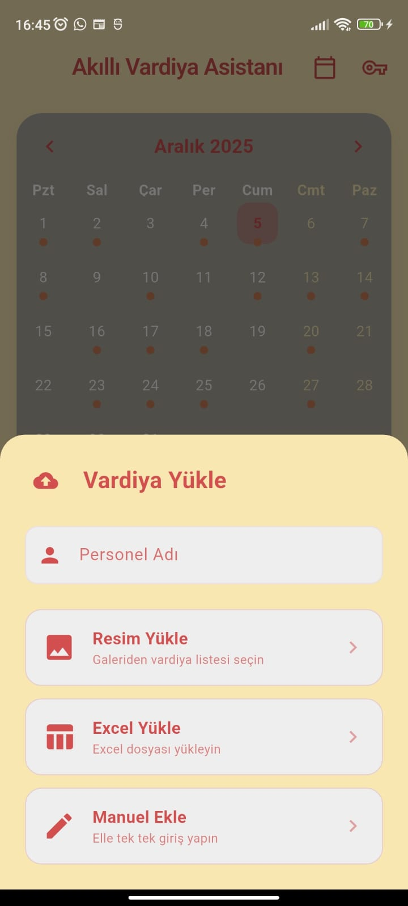
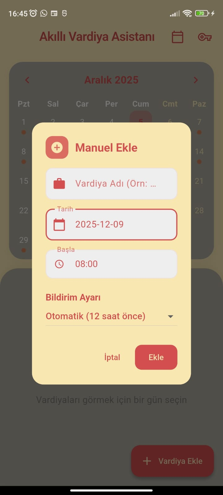
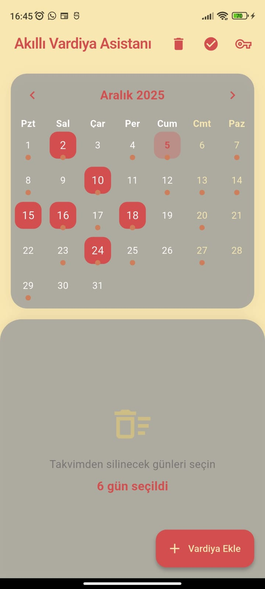

# 📅 Akıllı Vardiya Asistanı (Smart Shift Assistant)

**Akıllı Vardiya Asistanı**, vardiya takibini kolaylaştırmak için geliştirilmiş, **Google Gemini AI** destekli modern bir Flutter uygulamasıdır. Vardiya listelerinizi fotoğraf olarak yükleyin, yapay zeka sizin için takvime işlesin!


## 🚀 Özellikler

*   **🤖 Yapay Zeka Destekli Analiz:** Vardiya listenizin fotoğrafını çekin veya galeriden yükleyin; Gemini AI vardiyalarınızı otomatik olarak okuyup takviminize eklesin.
*   **📊 Excel Desteği:** Excel dosyalarındaki vardiya listelerini içe aktarın.
*   **📅 Gelişmiş Takvim Görünümü:** Vardiyalarınızı aylık takvim üzerinde renkli ve anlaşılır bir şekilde görüntüleyin.
*   **📝 Liste Görünümü:** Seçili gündeki vardiyaları detaylı liste halinde inceleyin.
*   **✏️ Kolay Yönetim:** Vardiyaları manuel olarak ekleyin, düzenleyin veya silin.
*   **🗑️ Toplu Silme:** Takvimden veya listeden çoklu seçim yaparak vardiyaları hızlıca silin.
*   **🎨 Modern Tasarım:** Göz yormayan, şık ve kullanıcı dostu arayüz.

## 📸 Ekran Görüntüleri

| Ana Ekran & Takvim | API Key Ekleme | Yükleme Seçenekleri | Manuel Ekleme | Silme |
|:---:|:---:|:---:|:---:|:---:|
|  |  |  |  |  |
| *Takvim görünümü ve vardiyalar* | *API Key ekleme* | *Resimden, Excel ve Manuel ekleme* | *Manuel ekleme* | *Silme* |


## 🛠️ Kullanılan Teknolojiler

*   **[Flutter](https://flutter.dev/):** Cross-platform mobil uygulama geliştirme framework'ü.
*   **[Google Generative AI (Gemini)](https://ai.google.dev/):** Görüntü işleme ve metin analizi için.
*   **[Table Calendar](https://pub.dev/packages/table_calendar):** Özelleştirilebilir takvim bileşeni.
*   **[Excel](https://pub.dev/packages/excel):** Excel dosyalarını okumak için.

## 🏁 Kurulum ve Çalıştırma

Projeyi yerel makinenizde çalıştırmak için aşağıdaki adımları izleyin:

1.  **Projeyi Klonlayın:**
    ```bash
    git clone https://github.com/AliHanBtmz/VardiyaApp.git
    cd VardiyaApp
    ```

2.  **Bağımlılıkları Yükleyin:**
    ```bash
    flutter pub get
    ```

3.  **API Anahtarını Alın:**
    *   [Google AI Studio](https://makersuite.google.com/app/apikey) adresinden bir Gemini API anahtarı edinin.
    *   Uygulama içinde API anahtarı girmeniz istendiğinde bu anahtarı kullanın.

4.  **Uygulamayı Başlatın:**
    ```bash
    flutter run
    ```

## 🤝 Katkıda Bulunma

Katkıda bulunmak isterseniz, lütfen bir "Pull Request" gönderin veya bir "Issue" açın. Her türlü katkı memnuniyetle karşılanır!


